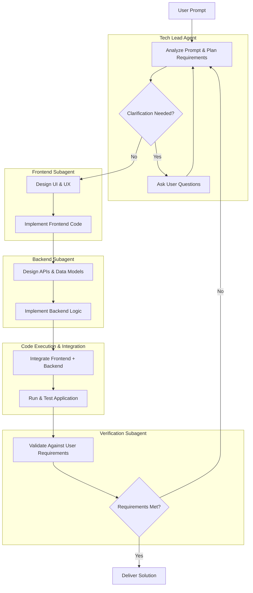

# Knit.dev
Knit.dev is an AI-powered coding agent that intelligently orchestrates a team of specialized AI agents to build, debug, and manage entire software projects from a single prompt, all within your terminal.

## First Prototype Architecture

