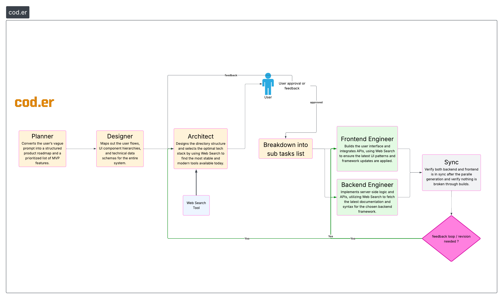

  

## What is cod.er?

**cod.er** is an autonomous software engineer that writes, debugs, and deploys code independently. It understands requirements, designs solutions, implements features, and iterates based on feedback, all without human intervention.

## Architecture

  

